# Guía de uso Janome MC550e
repositorio sobre la bordadora Janome Memory Craft 550e del taller textil UDD

------------------------

$$\color{red}\Huge{\textsf{Considerar!}}$$

## Precauciones

- No acercarse a la aguja mientras la máquina está realizando un bordado.
- No interrumpir el movimiento del bastidor ni el carro, esto dañaría la máquina.
- Si desea detener el trabajo por algún motivo, basta con presionar el botón `Start/Stop`, esto hará que se pause el trabajo, y se retomará al volver a presionarlo.
- Seguir atentamente las advertencias que aparecen en la pantalla de la máquina.

## Materiales

- Tela (al menos un trozo de 20x20cms, se ha probado con crea y gasa).
- Entretela (al menos un trozo de 20x20cms).
- Carrete de hilo (más bobina).

## Recomendaciones

- Leer el manual de instrucciones de la máquina, y ver el siguiente tutorial: [https://www.youtube.com/watch?v=I_Nd-3ZJbas](https://www.youtube.com/watch?v=I_Nd-3ZJbas).
- Documentar los procesos y resultados al utilizar distintas telas, hilos, y tipos de bordado, esto permitirá que este repositorio se siga nutriendo con información que nos sirva a todas y todos.

A continuación se muestra el manual de instrucciones de la bordadora en caso de que se necesite.

## **Manual de Instrucciones** *Janome Memory Craft 550e*

---

## Uso

Antes de comenzar con el uso de la máquina recuerde revisar las consideraciones que están más arriba [🔗](#precauciones). Tras haber leído el manual de instruciones y/o haber visto el tutorial, identifique las partes de la máquina, en caso de ya haber trabajado con una máquina de coser recta encontrará varias similitudes.

### Partes

Para el uso de la máquina es necesario identificar tanto las partes mecánicas, como las digitales. A continuación se muestran las principales, igualmente puede consultar el manual de instruciones para saber la ubicación y mayor detalle (pág 3, 4, 5 y 8).

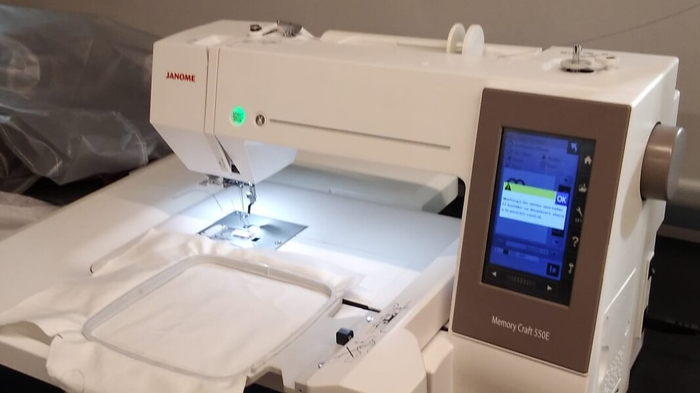

#### Mecánicas

- Aguja: cuenta con un orificio para pasar el hilo del carrete.
- Prensatelas tiene 3 alturas, la más baja solo se usa para realizar un trabajo, el resto del tiempo debe estar a la altura media, y cada vez que el carro se mueva para montar o desmontar un bastidor se debe levantar hasta la mayor altura, para evitar choques con los bordes del bastidor.
- Portacarretes: para poner el carrete de hilo, al poner el hilo desde ahí a la aguja se deben seguir los pasos trazados en la carcasa de la máquina.
- Bobina: va en la parte inferior, bajo una cubierta acrílica, al instalarla, se deben seguir los pasos trazados en la máquina.
- Carro: para poner los distintos bastidores , este además se encarga de realizar los movimientos en dos ejes para hacer los bordados.
- Bastidores: se cuenta con 4 distintas medidas, 14x14 cms, 14x20 cms, 20x20 cms, y 20x36 cms.
- Volante: al ser una máquina automática no se usa mucho pero es posible usarla para mover el mecanísmo.

|<!-- -->|<!-- -->|
|:---:|:---:|
|Aguja| Prensatelas|
|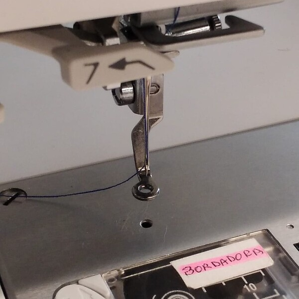|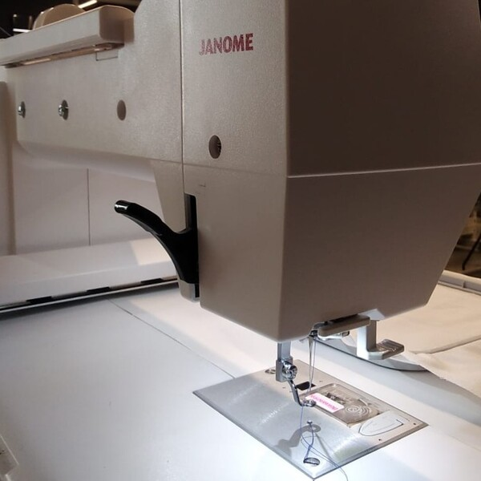|
|Carro| Bastidores|
|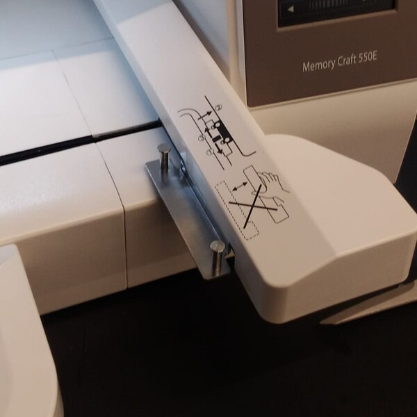|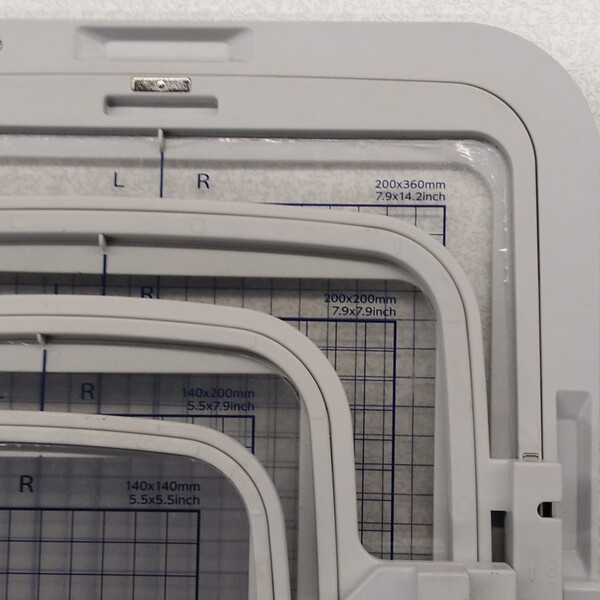|
|Bastidor 14x14 cms| Bastidor 14x20 cms|
|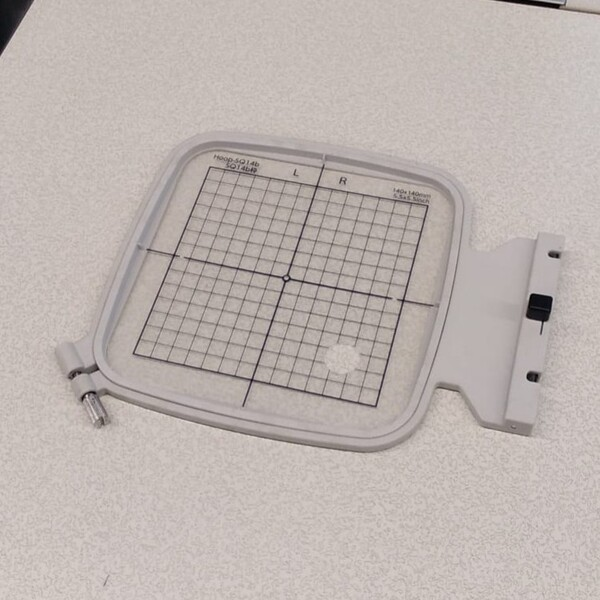|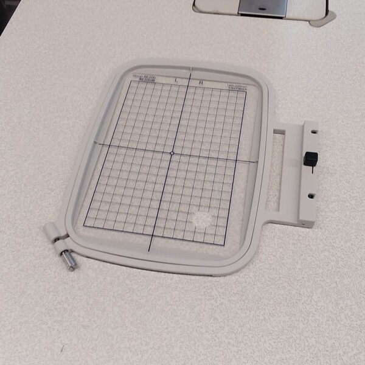|
|Bastidor 20x20 cms| Bastidor 20x36 cms|
|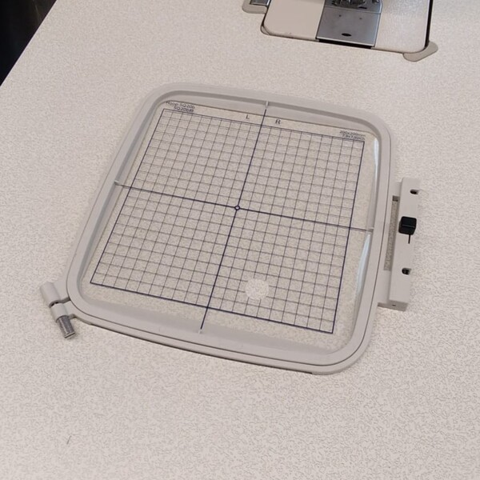|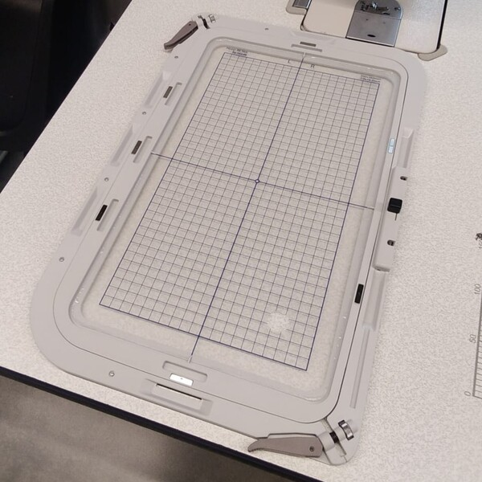|

#### Botones

- Interruptor de encendido (al costado derecho de la máquina).
- Botón `Start/Stop` (al frente de la máquina, verde si está encendida y no está trabajando, rojo si está trabajando).
- Botones laterales de la pantalla:
    - Botón `Inicio 🏠`: desplega en la pantalla un menú con 5 opciones, el ícono de bastidor para mover el carro a la posición para desmontarlo, la equis `❌` para cerrar el menú, el girasol `🌻` para seleccionar los bordados guardados en la memoria interna de la máquina, el de letras `ABC` para escribir un bordado con las tipografías internas de la máquina, y el de rejilla `▦` para configurar el trabajo a realizar (desde el bastidor, a la posición de cada bordado).
    - Botón `Archivo 📁`: despliega en la pantalla el menú para navegar en las carpetas de la mamoria interna y de la memoria USB puesta, para importar archivos a la mesa de trabajo.
    - Botón `Configuración 🛠️`: despliega el menú de configuraciones, se pueden guardar ajustes y usarlos.
    - Botón `Ayuda ❓`: despliega el menú de ayuda con una explicación visual de varios pasos importantes.
    - Botón `Bloqueo 🔑`: desactiva y activa el resto de botones, se suele usar para evitar que se pasen a llevar las configuraciones.

### Preparación

Antes de encender la máquina ya se puede preparar, hay que poner el carrete y la bobina siguiendo las indicaciones trazadas en la carcasa, también poner la tela junto a la entretela en el bastidor escogido.

|<!-- -->|<!-- -->|
|:---:|:---:|
|Paso del hilo|Paso del hilo por la aguja|
|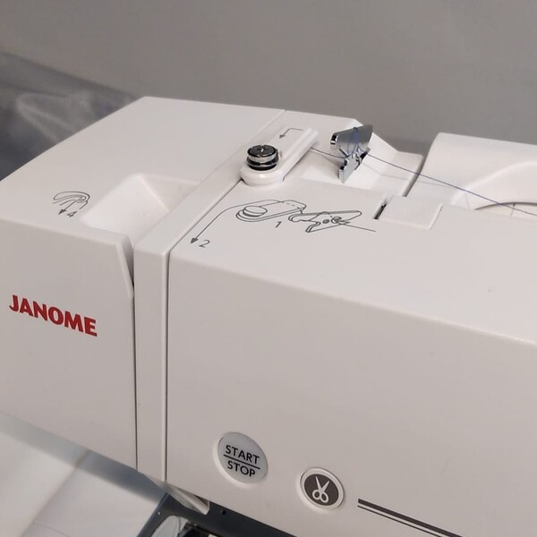||
|Apertura de la tapa de la bobina|Posicionamiento de la bobina|
|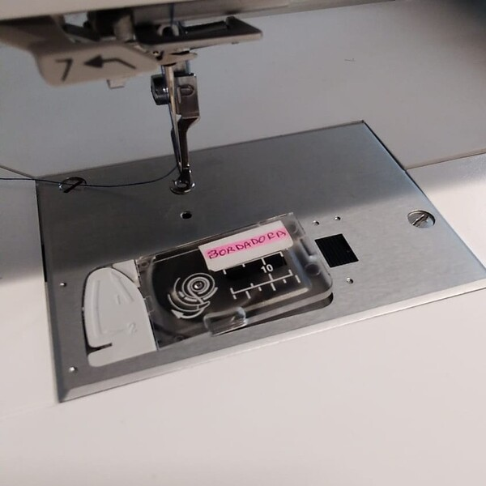|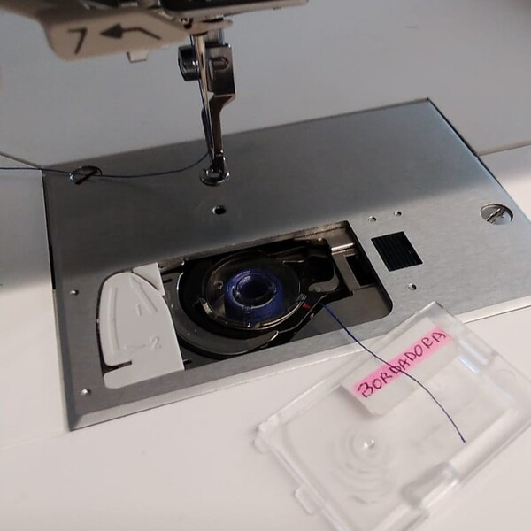|
|Parte inferior del bastidor sin tela|Bastidor con entretela|
|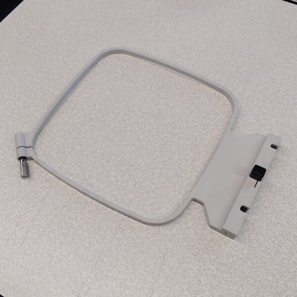|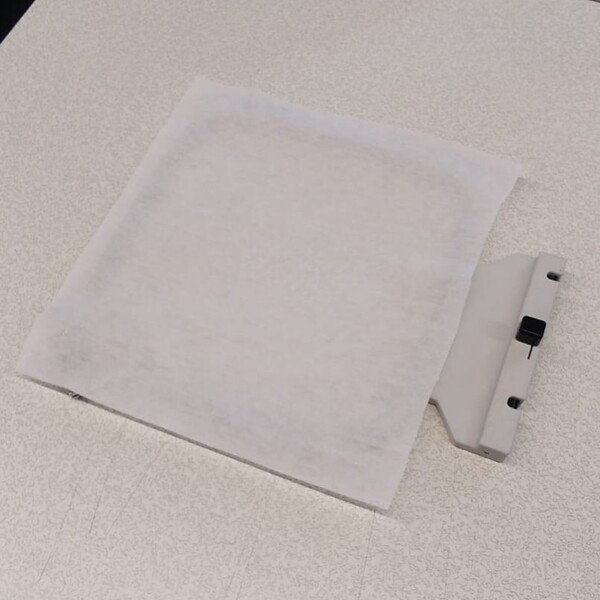|
|Bastidor con tela sobre la entretela| Bastidor visto desde abajo para apriete|
|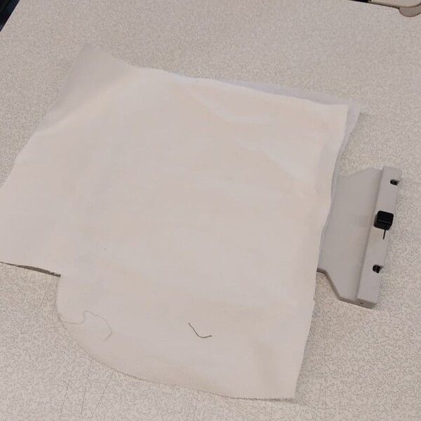|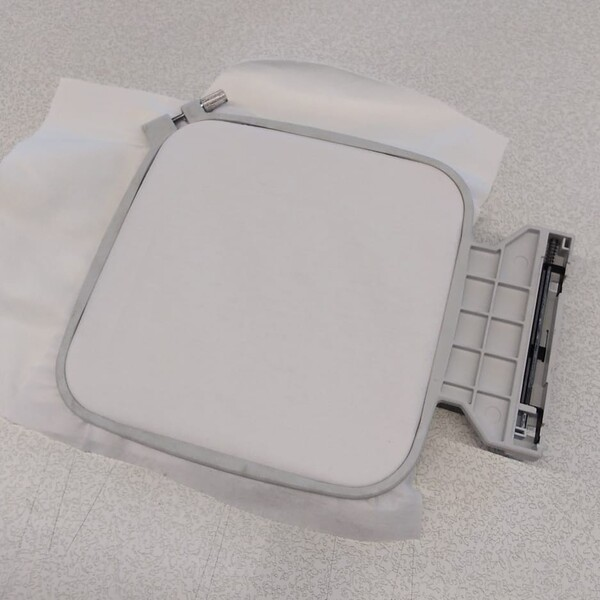|

Tras ello hay que encender la máquina (lo anterior se puede realizar con la máquina ya encendida), ... TODO pasos para poner el bastidor

### Bordado

TODO

A continuación se muestran distintas pantallas mostradas por la máquina durante el proceso. 

|<!-- -->|<!-- -->|
|:---:|:---:|
|P01: Advertencia movimiento del carro|P02: Pantalla de inicio|
|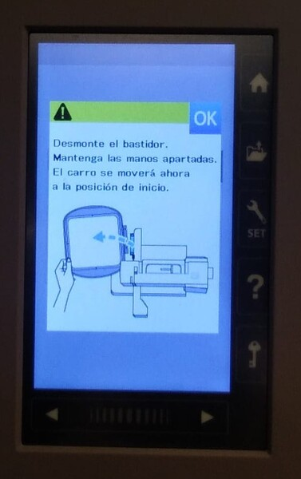|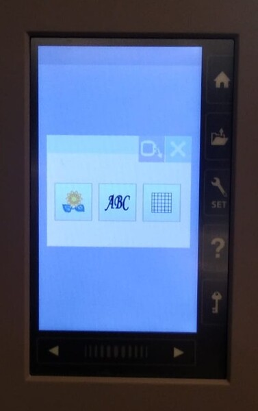|
|P03: Mesa de trabajo por defecto|P04: Selección del bastidor|
||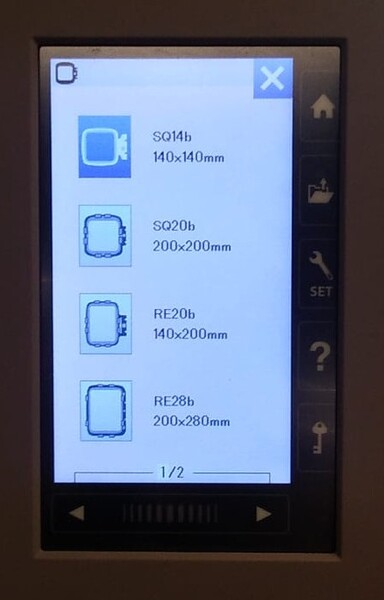|
|P05: Menú de inicio para ir al girasol|P06: Menú para seleccionar el bordado|
|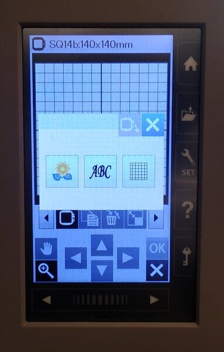|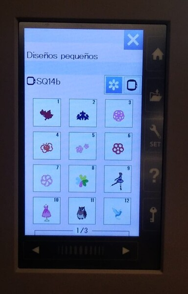|
|P07: Bordado escogido en la mesa de trabajo|P08: Bordado desplazado al lugar requerido|
|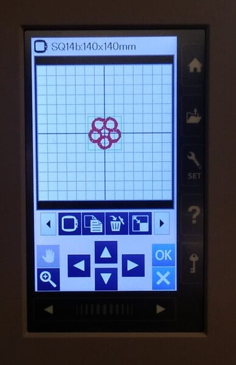|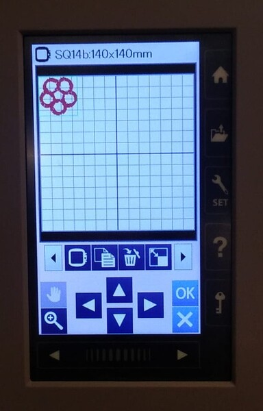|
|P09: Advertencia movimiento del carro a la posición central|P10:  Advertencia bastidor escogido|
|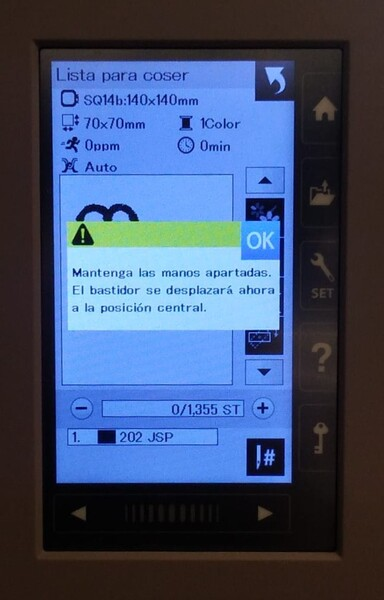||
|P11: Advertencia para bajar el prensatelas| P12: Advertencia levantar el prensatelas|
|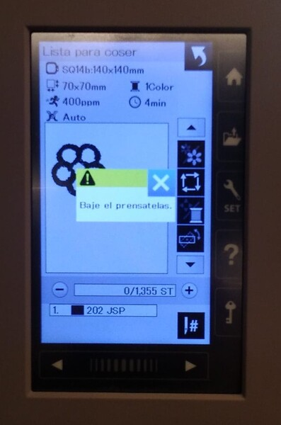|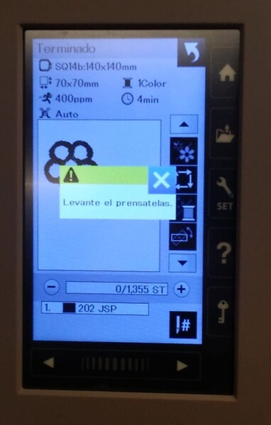|
|P13: Bordado escogido en la mesa de trabajo||
|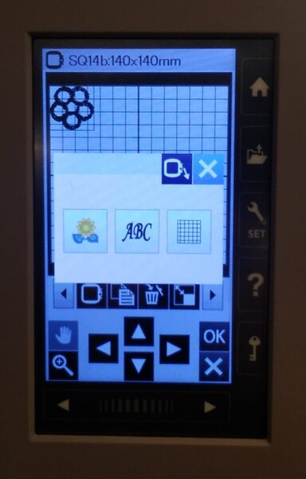||

#### Bordar archivos internos

TODO describir secuencia

|<!-- -->|<!-- -->|<!-- -->|
|:---:|:---:|:---:|
|Prensatelas abajo |Prensatelas medio|Prensatelas arriba|
|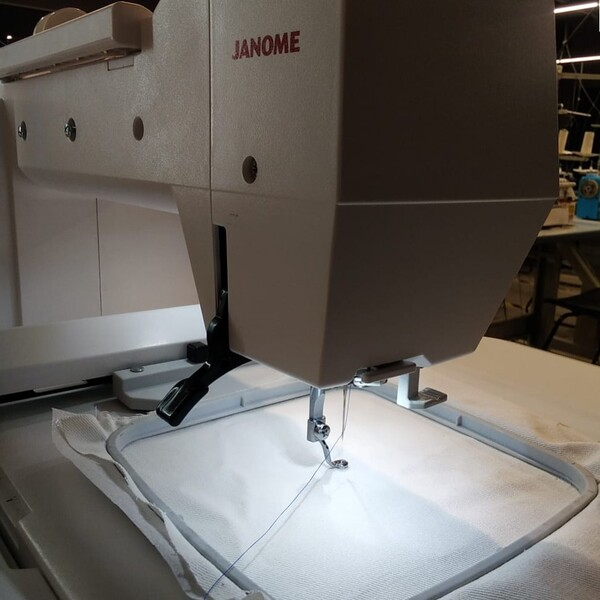||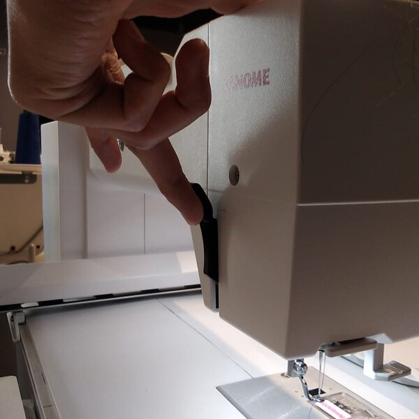|

#### Bordar archivos del USB

Con la memoria USB puesta en el costado derecho de la máquina, hay que presionar el botón `Archivo 📁` al lado de la pantalla, desde ahí se puede navegar por los archivos de la impresora y del USB. En la parte superior de la pantalla hay un ícono de una maquina de coser y otro de un pendrive USB, lo que indica en cual de las memorias se está navegando.

Al poner el USB por primera vez en la bordadora se generarán unas carpetas en las que deben estar los archivos de bordado tipo `.jef`, las carpetas son `./EMB/` y `./EMB/Embf/`, y todo lo que esté fuera de estas carpetas será ignorado por la máquina.

|<!-- -->|<!-- -->|
|:---:|:---:|
|P14: Explorador de archivos|P15: Bordados de la memoria USB|
|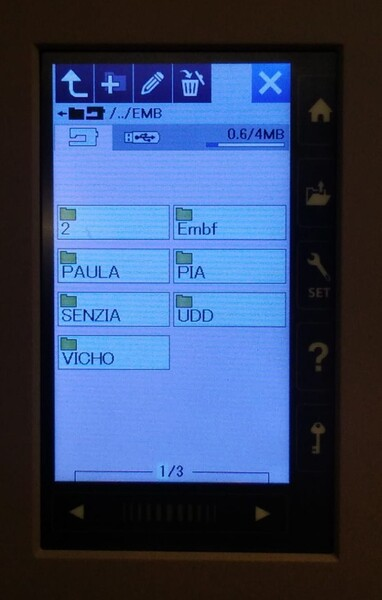|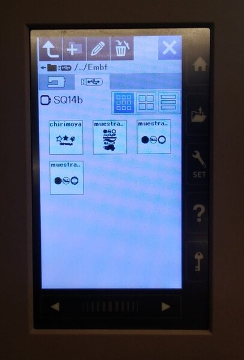|

Si quieres diseñar tus propios bordados puedes continuar con el manual de uso de InkStitch de Inkscape

[CONTIUNUAR A INK/STITCH](inkstitch/)

---
>documentado por [AndresMartinM](https://github.com/AndresMartinM) 2025